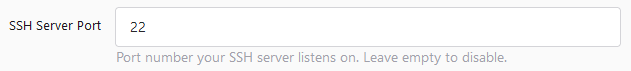

# Install Forgejo container on Fedora Linux

Forgejo is described as a self-hosted lightweight software forge. Forgejo, a software Fork of Gitea written in Go, is easy to maintain. This small guide presents a few steps for successfully running Forgejo using Podman on Fedora Linux.

## Installation

### Install podman

```bash
sudo dnf install podman
```

### Pull Docker image

```bash
docker pull codeberg.org/forgejo/forgejo:1.20.3-0
```

### Run Docker image
```bash
docker run -p 3000:3000 -v forgejo:/data codeberg.org/forgejo/forgejo:1.20.3-0
```

### SSH
To enable SSH access to Forgejo, define a ``SSH Server Point`` during the initialisation process. For example, to set port 22:


After initialisation, run the container with the following command:
```bash
docker run -p 3000:3000 -p 22:22 -v forgejo:/data codeberg.org/forgejo/forgejo:1.20.3-0
```

## Data
### Local data backup
To create a local backup of the data, get the container's ID by running the following command:
```bash
docker ps
```
    
Once you have the container's ID, run the following command to copy the data to a local directory:
```bash
docker cp <container_id>:/data /path/to/backup
```